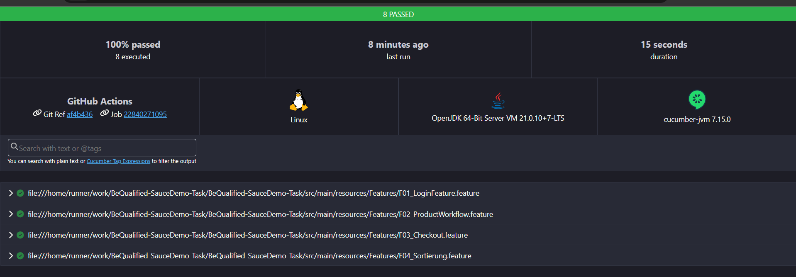

#  🚀 SauceDemo Regression Automation Suite

## 📋 Inhaltsverzeichnis
* [Einführung](#-einführung)
* [Kern-Features](#-kern-features)
* [Technologie-Stack](#-technologie-stack)
* [Projektstruktur](#-projektstruktur)
* [Installation & Ausführung](#-installation--ausführung)
* [Verifizierter Test-Report (CI/CD Proof)](#-verifizierter-test-report-cicd-proof) 

---

## 📖 Einführung
Dieses Framework dient der automatisierten End-to-End-Validierung des **SauceDemo** Webshops. Es stellt sicher, dass kritische Geschäftsprozesse – vom Login bis zum erfolgreichen Checkout – stabil und reproduzierbar funktionieren.

**Besonderer Fokus:**
* Hohe Teststabilität durch **Explicit Waits** (`WebDriverWait`).
* Volle CI/CD-Kompatibilität durch optimierte **Headless-Ausführung**.

---

## ✨ Kern-Features
* 🔐 **Sicherer Authentifizierungspfad**: Validierung des Logins und korrekte Weiterleitung zur Inventar-Seite.
* 🛒 **Dynamisches Cart-Management**: Produkte werden flexibel anhand ihrer Namen identifiziert und dem Warenkorb hinzugefügt.
* 💳 **Checkout-Validierung**: Automatisierte Prüfung des Subtotals sowie der erfolgreichen Bestellbestätigung.
* 📊 **UI-Sortierprüfung**: Verifizierung der Sortierreihenfolge nach Preis (Low/High) und Alphabet (A-Z/Z-A).

---

## 🛠 Technologie-Stack
* **Sprache:** Java 21 & Maven
* **Browser-Steuerung:** Selenium WebDriver
* **BDD Framework:** Cucumber mit Gherkin
* **Test Runner:** TestNG
* **Design Pattern:** Page Object Model (POM)

---

## 📁 Projektstruktur
* `src/main/java/pages`: Enthält Page Objects mit stabilen Locators und gekapselter Logik.
* `src/test/java/stepDefinition`: Java-Implementierung der BDD-Schritte sowie Hooks (Setup/Teardown).
* `src/main/resources/Features`: Gherkin-Dateien für die fachliche Testbeschreibung.
* `target/cucumber-reports/`: Speicherort für die generierten Testergebnisse.

---

### 🚀 Installation & Ausführung
1. `git clone https://github.com/abdullahnasre/BeQualified-SauceDemo-Task.git`
2. `mvn clean install`

### 📊 Verifizierter Test-Report (CI/CD Proof)
Die gesamte Regression-Suite wurde erfolgreich in der GitHub Actions Umgebung validiert.

> **Ergebnis:** 8 Scenarios Passed (100% Erfolg) unter Linux/Headless.
